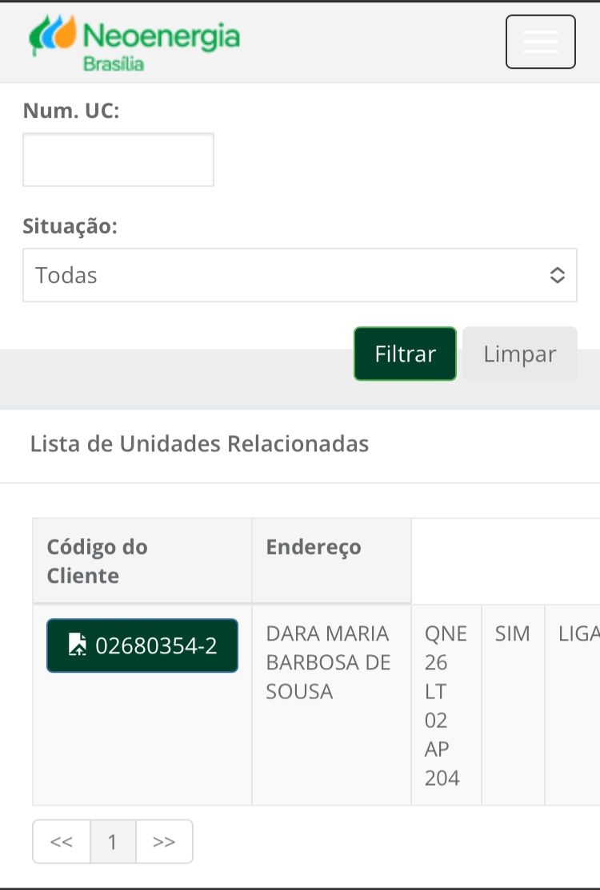

# GOMS (Goals, Operators, Methods, And Selection Rules)

## Introdução 
O GOMS é um método para descrever uma tarefa e o conhecimento do usuário sobre
como realizá-la em termos de objetivos (goals), operadores (operators), métodos (methods)
e regras de seleção (selection rules).

 - Os objetivos representam o que o usuário quer realizar utilizando o software
 - Operadores: são as ações cognitivas ou físicas que o sistema permite que o usuário execute, como inserir dados via teclado.
 - Os métodos são sequências bem conhecidas de sub-objetivos e operadores que permitem atingir um objetivo maior.
 - Regras de exceção: Referem-se a tomada de decisão por parte do usuário diante da possibilidade de possuir mais de um método.

## Funcionalidades Avaliadas pela GOMS
     Tabela que monstra quais funcionalidades foram avaliadas pela HTA

 Funcionalidade    |    Integrante Responsável             |  
|:------:|:-------------------------------:|
| 2ª via de pagamento |Dara|  
| Unidades cadastradas | Davi |
| Serviços disponíveis no site | Davi   |
| Cadastro de parceiro   | Davi          |
| Solicitação sobre danos elétricos | Davi |

 Figura 1 - Página inicial da Agência Virtual da Neoenergia. 
 

 Fonte: Site da agência virtual  
 

### 2ª via de pagamento 
#### Introdução 
No site da agência virtual da Neoenergia forma escolhidas algumas funcionalidades, entre elas a de visualização, pesquisa e geração de segunda via de _Boletos_. [Dara Maria](https://github.com/daramariabs) foi escolhida como responsável por essa funcionalidade. 
* Goal 1: Listar todas as funcionalidades da agência virtual
    * Method 1: Inserir dados - deixar os espaços sem preencher.
    * Method 2: Inserir os dados incorretamente.

* Goal 2: Procurar um cadastro específico
    * Method 1: Ir até o endereço da Agência Virtual (ou real ou eletrônico) e informar os seguintes dados
        * Operation 1: Informar nome a ser buscado
        * Operation 2: Informar o CPF
        * Operation 3: Informar CEP (opcional)
        * Operation 4: Informar região (opcional)
        * Operation 5: submeter dados

 Figura 2 - Página para requerimento da segunda via do boleto. Fonte: Site da agência virtual  
 

### Unidades cadastradas
Nessa tarefa o usuário pretende solicitar todas as unidades cadastradas em seu CPF, foi analisada pelo integrante [Davi Casseb](https://github.com/dcasseb). Primeiro na página como mostra na Figura 3, em seguida pede-se o código do cliente e o código da UC como mostrada na Figura.

 Figura 3 - Página para requerimento das unidades cadastradas no CPF. Fonte: Site da agência virtual  
 

* GOAL 0: Descobrir se a pessoa possui unidades cadastradas.
  * GOAL 1: Solicitar os imóveis cadastrados em seu CPF.
    * METHOD 1.A: Acessar o sistema de solicitação da agência virtual.

    (SEL. RULE: O usuário possui acesso ao sistema e sabe como navegar nele.)

    * METHOD 1.B: Entrar em contato com a Neoenergia por telefone ou e-mail para obter instruções sobre como solicitar os registros em seu CPF.

    (SEL.RULE: O usuário não está familiarizado com o sistema online ou não possui acesso a ele.)

  * GOAL 2: Preencher corretamente os dados necessários para a solicitação de unidades cadastradas.
    * METHOD 2.A: Inserir os dados pessoais da pessoa para quem os registros estão sendo solicitados.

    (SEL. RULE: O usuário possui os dados pessoais da pessoa.)

      * OP. 2.A.1: Digitar o nome completo da pessoa.
      * OP. 2.A.2: Preencher o CPF (Cadastro de Pessoa Física) da pessoa.
      * OP. 2.A.3: Fornecer o RG (Registro Geral) da pessoa.
      * OP. 2.A.4: Se aplicável, inserir a data de nascimento da pessoa.
      * OP. 2.A.5: Inserir o endereço residencial completo da pessoa.
      * OP. 2.A.6: Se aplicável, incluir o endereço comercial completo da pessoa.
      * OP. 2.A.7: Indicar o CEP (Código de Endereçamento Postal) tanto do endereço residencial quanto do endereço comercial.

    * METHOD 2.B: Revisar os dados fornecidos para garantir que estejam corretos e completos.

    (SEL. RULE: O usuário deseja evitar erros na solicitação.)

      * OP. 2.B.1: Verificar se todos os campos foram preenchidos corretamente.
      * OP. 2.B.2: Revisar se não há erros de digitação nos dados fornecidos.
      * OP. 2.B.3: Confirmar se os dados estão atualizados e correspondem à pessoa correta.
      * OP. 2.B.4: Corrigir qualquer informação incorreta ou incompleta identificada durante a revisão.
  
  * GOAL 3: Confirmar o envio da solicitação.
    * METHOD 3.A: Enviar a solicitação através do sistema online e aguardar a confirmação.

    (SEL. RULE: O usuário tem acesso à internet e confia na eficácia do sistema.)

    * METHOD 3.B: Entrar em contato com a Neoenergia para confirmar o recebimento da solicitação.

    (SEL. RULE: O usuário prefere confirmar pessoalmente.)

  * GOAL 4: Receber um código de acompanhamento da solicitação.
    * METHOD 4.A: Aguardar o recebimento do código de acompanhamento através do e-mail fornecido na solicitação.

    (SEL. RULE: O usuário confia na eficácia do sistema de envio de e-mails.)

    * METHOD 4.B: Entrar em contato com a Neoenergia para solicitar o código de acompanhamento, caso não seja recebido dentro do prazo esperado.

    (SEL.RULE: O usuário prefere confirmar pessoalmente.)

###  Página nos dispositivos móveis

Nessa tarefa o usuário pretende avaliar a responsividade da agência virtual em dispositivos móveis. Realizado por [Henrique Alencar](https://github.com/henryqma)

 Figura 3 - Página para requerimento das unidades cadastradas no CPF em um dispositivo móvel. Fonte: Site da agência virtual  
 

* GOAL 0:  Analisar a responsividade da página 
    * GOAL 1: Preencher os dados do usuário
        * OP 1.1: Preencher o número do CPF
        * OP 1.2: Preencher o nome completo do usuário
        * OP 1.3: Preencher o CEP da unidade cadastrada
    * GOAL 2: Avaliar o tamanho dos ícones
        * OP 2.1: Mudar a orientação do dispositivo de vertical para horizontal
        * OP 2.2: Realizar tarefa aleatória para testar a integridade do sistema
    * GOAL 3: Verificar ferramentas de acessibilidade
        * OP 3.1: Clicar em "Acessibilidade", caso disponível
        * OP 3.2: Verificar legibilidade das letras e ícones
        * OP 3.3: Verificar a facilidade de discernimento dos ícones

## Bibliografia
> BARBOSA, S.D.J.; SILVA, B.S. Interação Humano-Computador. Editora Campus-Elsevier, 2010.

## Referências bibliograficas

> Agência virtual da Neoenergia. Neoenergia. Disponível em: [https://agenciavirtual.neoenergiabrasilia.com.br/](https://agenciavirtual.neoenergiabrasilia.com.br/). Acesso em: 02 dez 2024.

## Histórico de Versões

| Versão |          Descrição              |     Autor(es)      |      Data      |   Revisor(es)     |    Data de revisão    |  
|:------:|:-------------------------------:|:--------------:|:--------------:|:-------------:|:---------------------:|
|  1.0   | Criação do Documento GOMS                  |  [Davi Casseb](https://github.com/dcasseb), [Henrique Alencar](https://github.com/henryqma), [Dara Maria](https://github.com/daramariabs)      |   30/11   |     [Davi Casseb](https://github.com/dcasseb), [Henrique Alencar](https://github.com/henryqma), [Dara Maria](https://github.com/daramariabs)   |        02/12     |