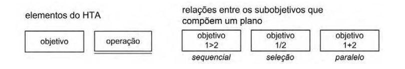
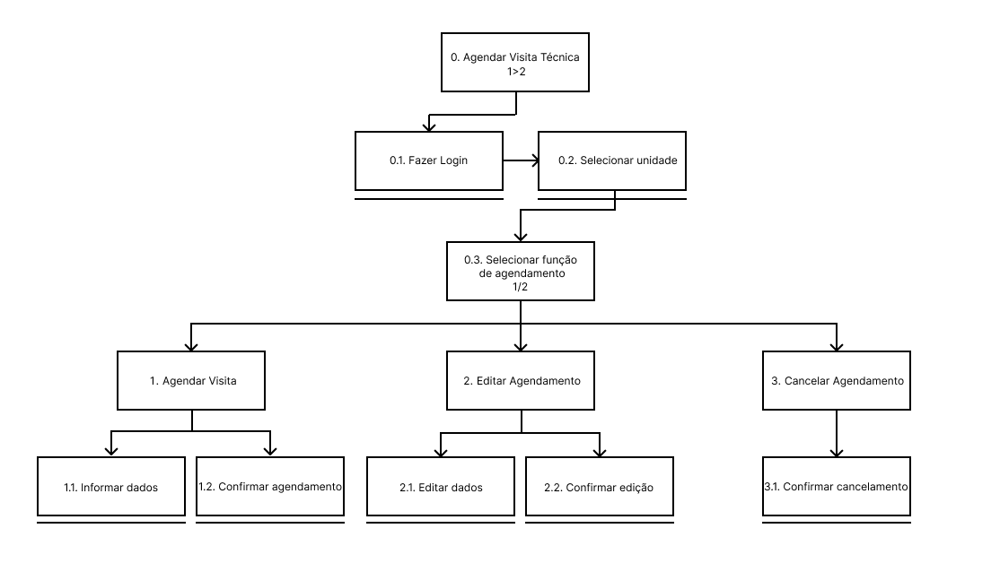

# **Análise Hierárquica de Tarefas**

## Introdução

A Análise Hierárquica de Tarefas (HTA) é uma maneira de entender e dividir uma tarefa complicada em partes menores, organizando essas partes em uma hierarquia que inclui objetivos, subobjetivos e operações. Isso ajuda a entender melhor como uma pessoa segue passos para completar uma tarefa e a descobrir dificuldades e oportunidades de melhoria. A HTA é bastante usada em várias áreas, como desenvolvimento de produtos, serviços e aprimoramento de processos. A figura 1 mostra a notação utilizada no diagrama HTA:

**Figura 1** - Diagrama HTA

{ width="900px" }

_Fonte: BARBOSA e SILVA, 2011_

## Tarefas Analisadas

Para a realização desse artefato, cada integrante realizou a análise de uma tarefa diferente, que podem ser encontradas na tabela 1 e detalhadas a seguir:

**Tabela 1** - Funcionalidades avaliadas

 Funcionalidade    |    Integrante Responsável             |  
|:------:|:-------------------------------:|
| [Agendar visita técnica](#agendar-visita-técnica) | Henrique  |

_Fonte: Henrique Alencar_

### Agendar Visita Técnica

A tarefa analisada pelo [Henrique Alencar](https://github.com/henryqma) foi o agendamento de visita técnica. O objetivo dessa tarefa é que o usuário consiga realizar, verificar, editar ou cancelar o agendamento da visita de um técnico na sua residência.

**Figura 2** - Diagrama HTA de agendar visita técnica

{ width="900px" }

_Fonte: Henrique Alencar_

**Tabela 2** - HTA de agendar visita técnica

| Objetivos/Operações | Problemas e recomendações |
| ------------------- | ------------------------- |
| 0. Agendar Visita Técnica |                     |
| 0.1. Fazer Login | input: dados de login   feedback: redirecionado para escolha de unidade |
| 0.2. Escolher unidade | input: apertar no botão da unidade cadastrada   feedback: redirecionado para menu principal |
| 0.3. Escolher função de agendamento | input: apertar botão de agendamento   feedback: redirecionado para agendamentos |
| 1. Agendar visita | input: botão de criar novo agendamento   feedback: campo para solicitar agendamento |
| 1.1 Informar dados | input: digitar informações do problema e data   feedback: exibir informações colocadas |
| 1.2 Confirmar agendamento | input: botão para confirmação:   feedback: mensagem confirmando agendamento |
| 2. Editar agendamento | input: botão para selecionar agendamento   feedback: campo para editar agendamento |
| 2.1 Editar dados | input: editar informações do problema e data   feedback: exibir informações editadas |
| 2.2 Confirmar edição | input: botão para confirmação:   feedback: mensagem confirmando agendamento |
| 3. Cancelar agendamento | input: botão para selecionar agendamento   feedback: exibir agendamento selecionado |
| 3.1 Confirmar cancelamento | input: botão de cancelamento   feedback: mensagem confirmando cancelamento |

_Fonte: Henrique Alencar_

## Bibliografia

> 1. BARBOSA, Simone; DINIZ, Bruno. Interação Humano-Computador. Editora Elsevier, Rio de Janeiro, 2010.

## Referências Bibliográficas

> 1. BARBOSA, Simone; DINIZ, Bruno. Interação Humano-Computador. Editora Elsevier, Rio de Janeiro, 2010.

## Histórico de versão

| Versão | Data       | Descrição                             | Autor(es)                                       | Revisor(es)             |
| ------ | ---------- | ------------------------------------- | ----------------------------------------------- | ----------------------- |
| `1.0`  | 04/01/2025 | Criação do documento                  | [Henrique Alencar](https://github.com/henryqma) | Dara Maria, Davi Casseb |