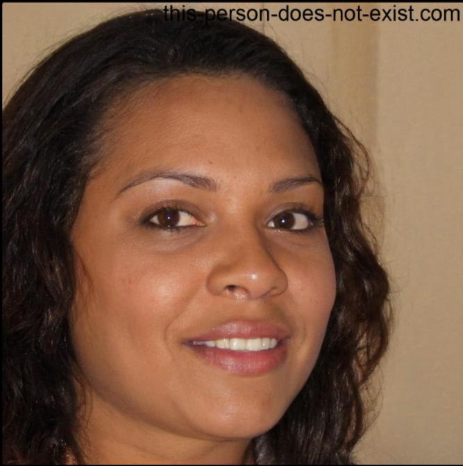
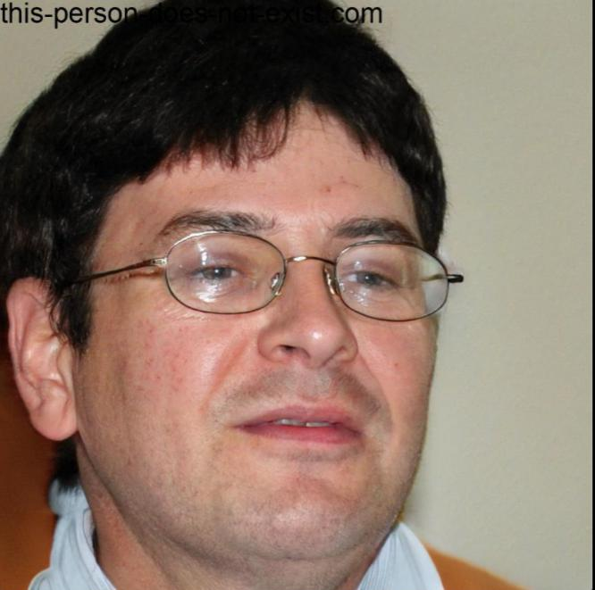
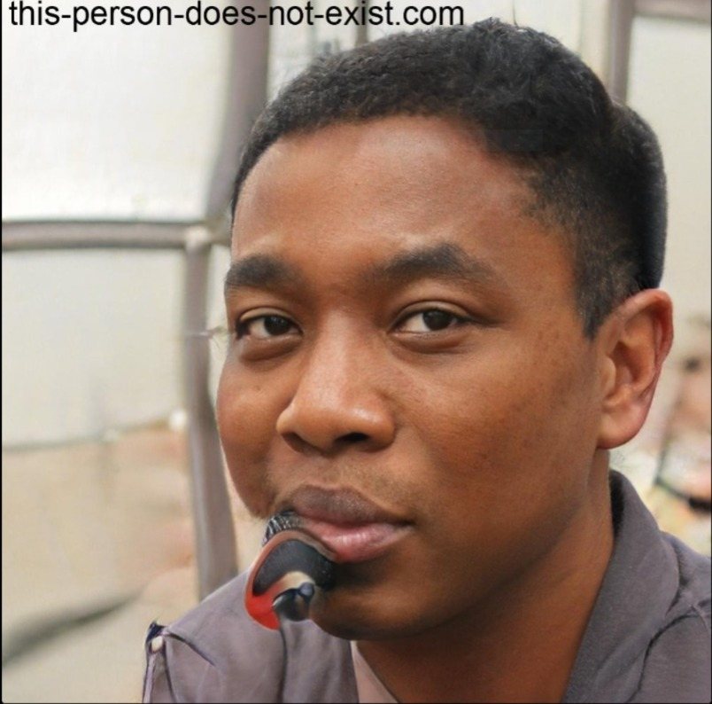

# **Personas**

## **Introdução**

A **Agência Virtual da Neoenergia** é uma plataforma digital que oferece serviços aos seus clientes, como emissão de faturas, consulta de histórico de consumo e solicitações administrativas. Compreender os perfis de usuários dessa plataforma é essencial para melhorar a experiência de navegação, resolver problemas de acessibilidade e atender às necessidades específicas de diferentes públicos. Este documento apresenta personas detalhadas, baseadas em dados simulados e práticas de design centrado no usuário, com o objetivo de alinhar a plataforma às expectativas de seus principais usuários.

## **Metodologia**

A construção das personas foi realizada com base em duas técnicas:  

- **Entrevistas estruturadas**: Foram realizadas entrevistas com usuários típicos do site, abrangendo questões sobre suas experiências, objetivos, dificuldades e sugestões de melhoria.  
- **Observações de uso**: Foi analisado o comportamento de navegação de diferentes tipos de usuários para identificar padrões de interação e pontos de frustração na plataforma.  

Os dados foram agrupados em perfis realistas que consideram aspectos demográficos, educacionais, comportamentais e motivacionais, de acordo com as boas práticas descritas no livro _Interação Humano-Computador_.

## **Definição de Personas**

  
### **Persona 1: Ana Paula**
  
| **Atributo**          | **Descrição**                                                                 |
|------------------------|-------------------------------------------------------------------------------|
| **Imagem**            | { width="200px" }              |
| **Idade**             | 35 anos                                                                      |
| **Sexo**              | Feminino                                                                     |
| **Ocupação**          | Assistente administrativa                                                    |
| **Localização**       | Brasília, DF                                                                 |
| **Renda**             | Classe média                                                                 |
| **Comportamentos**    | Acessa o site uma vez por mês para consultar faturas e realizar pagamentos.   |
| **Objetivos**         | Emitir segunda via da fatura, consultar histórico de consumo.                |
| **Frustrações**       | Dificuldade em localizar informações no site, lentidão em horários de pico.  |
| **Motivadores**       | Resolver questões remotamente com agilidade e conforto.                      |

Fonte: Dara Maria

### **Persona 2: Carlos Eduardo**

| **Atributo**          | **Descrição**                                                                 |
|------------------------|-------------------------------------------------------------------------------|
| **Imagem**            | { width="200px" }           |
| **Idade**             | 42 anos                                                                      |
| **Sexo**              | Masculino                                                                    |
| **Ocupação**          | Gerente financeiro de uma empresa de médio porte                             |
| **Localização**       | Brasília, DF                                                                 |
| **Renda**             | Classe média alta                                                            |
| **Comportamentos**    | Acessa semanalmente para gerenciar múltiplas contas de energia.               |
| **Objetivos**         | Gerar relatórios financeiros, analisar consumo de diferentes unidades.       |
| **Frustrações**       | Falta de ferramentas avançadas para filtragem/exportação de dados.           |
| **Motivadores**       | Controle preciso das contas da empresa e eficiência no trabalho.             |

Fonte: Dara Maria

### **Persona 3: Maria do Carmo**

| **Atributo**          | **Descrição**                                                                 |
|------------------------|-------------------------------------------------------------------------------|
| **Imagem**            | { width="200px" }         |
| **Idade**             | 68 anos                                                                      |
| **Sexo**              | Feminino                                                                     |
| **Ocupação**          | Aposentada                                                                   |
| **Localização**       | Brasília, DF                                                                 |
| **Renda**             | Classe média                                                                 |
| **Comportamentos**    | Acessa esporadicamente para verificar faturas e realizar pagamentos.          |
| **Objetivos**         | Resolver pendências de forma independente, emitir segunda via de faturas.    |
| **Frustrações**       | Dificuldade em entender termos técnicos, necessidade de design acessível.    |
| **Motivadores**       | Desejo de autonomia e confiabilidade no uso da plataforma.                   |

Fonte: Dara Maria

### **Persona 4: Rodrigo Silva**
  

| **Atributo**          | **Descrição**                                                                 |
|------------------------|-------------------------------------------------------------------------------|
| **Imagem**            | { width="200px" }           |
| **Idade**             | 29 anos                                                                      |
| **Sexo**              | Masculino                                                                    |
| **Ocupação**          | Técnico de manutenção na Neoenergia                                          |
| **Localização**       | Brasília, DF                                                                 |
| **Renda**             | Classe média                                                                 |
| **Comportamentos**    | Acessa o site para verificar informações técnicas e históricos de consumo.    |
| **Objetivos**         | Obter dados de consumo para análises técnicas, realizar verificações rápidas. |
| **Frustrações**       | Interface não prioriza consultas técnicas, pouca integração com sistemas internos. |
| **Motivadores**       | Agilidade no acesso aos dados necessários para o trabalho.                   |

Fonte: Dara Maria

## **Conclusão**

A análise resultou na criação de quatro personas que representam os principais perfis de usuários da Agência Virtual da Neoenergia: usuários residenciais, empresariais, idosos e técnicos. Cada persona possui necessidades e objetivos distintos, que devem ser considerados no aprimoramento da plataforma. As melhorias sugeridas incluem otimização da interface para diferentes dispositivos, maior acessibilidade para idosos, ferramentas avançadas para usuários empresariais e funcionalidades específicas para suporte técnico. Essas ações são fundamentais para garantir uma experiência mais satisfatória e alinhada às expectativas do público-alvo.

## Bibliografia

>  BARBOSA, Simone; DINIZ, Bruno. Interação Humano-Computador. Editora Elsevier, Rio de Janeiro, 2010.

## Histórico de versão

| Versão | Data       | Descrição                             | Autor(es)                                       | Revisor(es)             |
| ------ | ---------- | ------------------------------------- | ----------------------------------------------- | ----------------------- |
| `1.0`  | 29/11/2024 | Criação da página                     | [Henrique Alencar](https://github.com/henryqma) | Dara Maria, Davi Casseb |
| `1.1`  | 02/12/2024 | Adição dos perfis de personas                     | [Dara Maria](https://github.com/daramariabs) | Davi Casseb, Henrique Alencar |
| `1.2`  | 03/12/2024 | Adição das imagens das personas                     | [Dara Maria](https://github.com/daramariabs) | Davi Casseb, Henrique Alencar |
