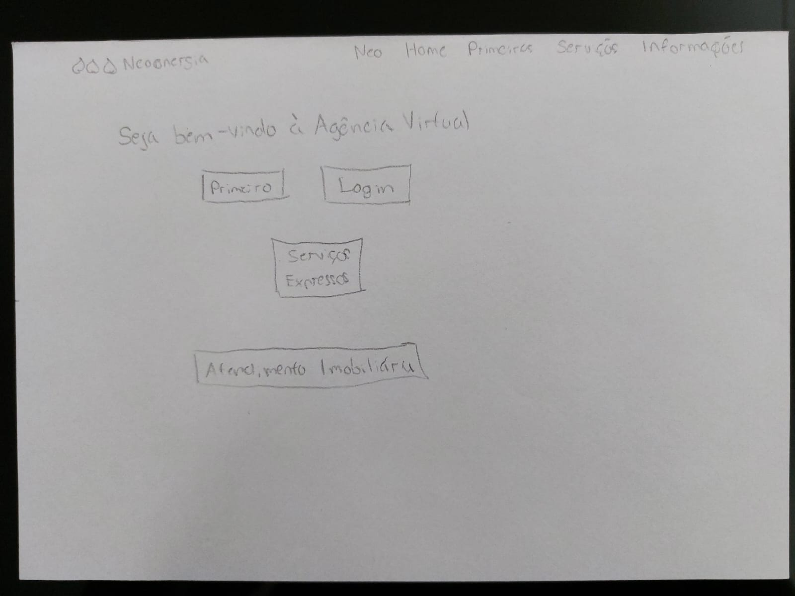
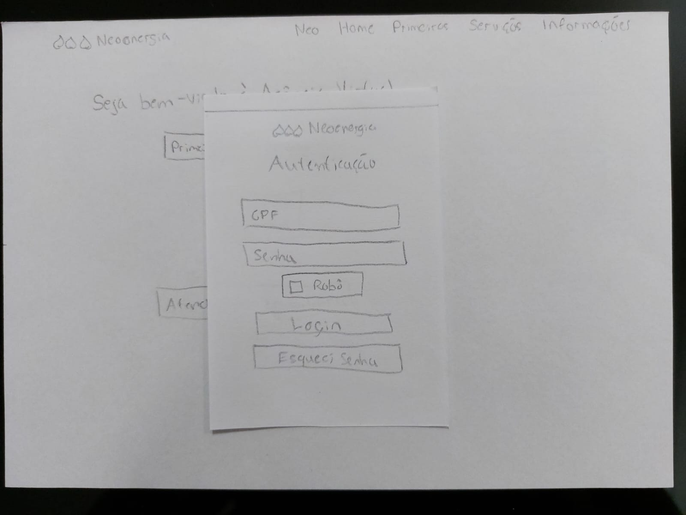
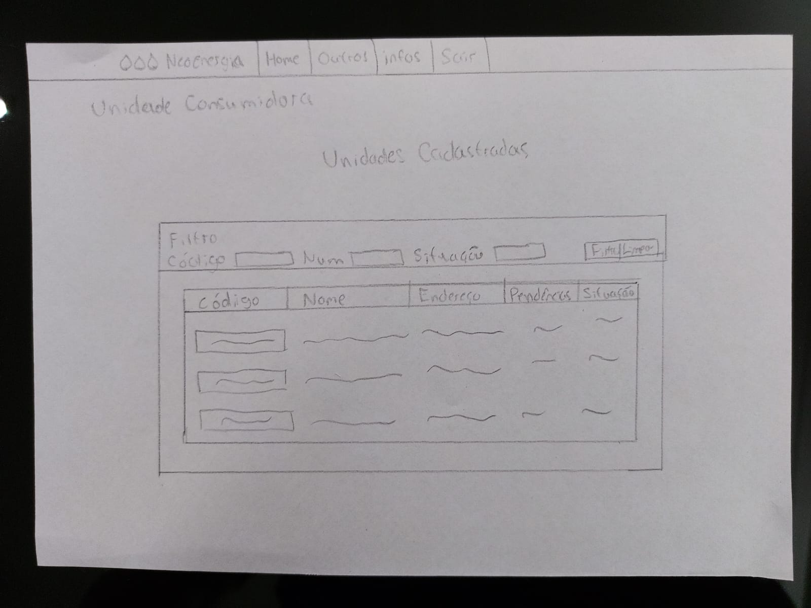
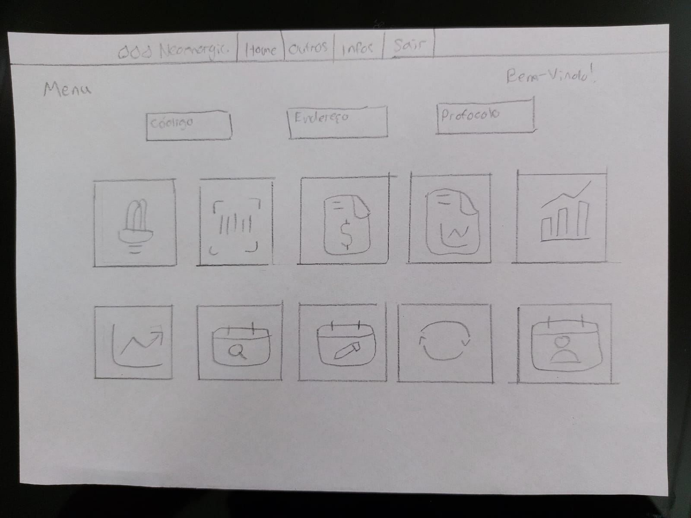
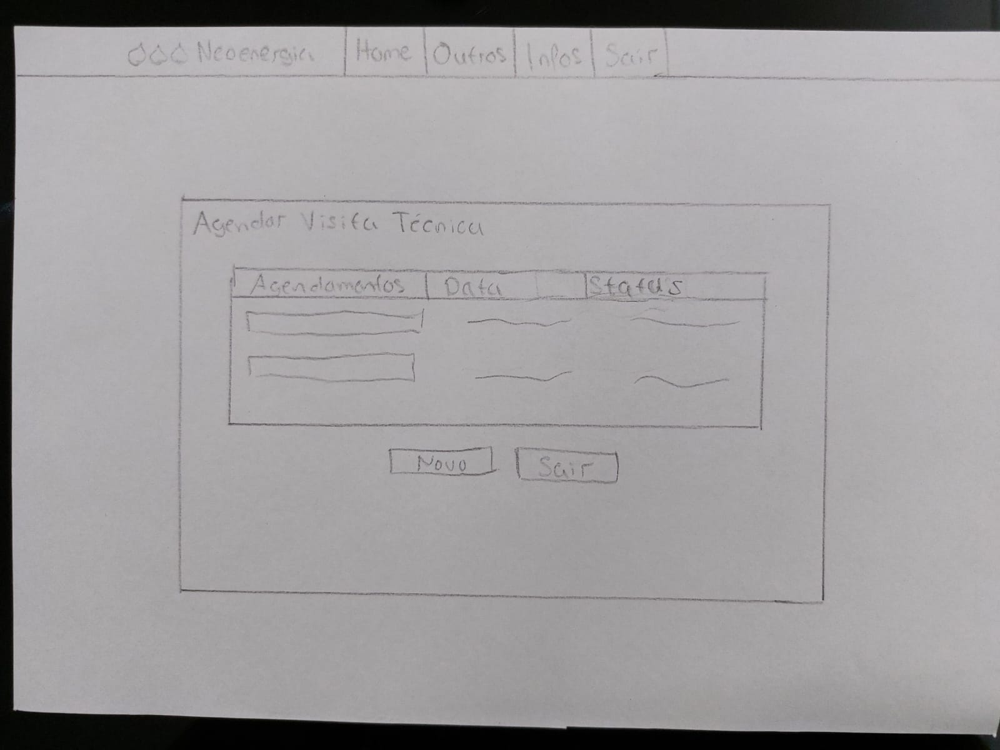
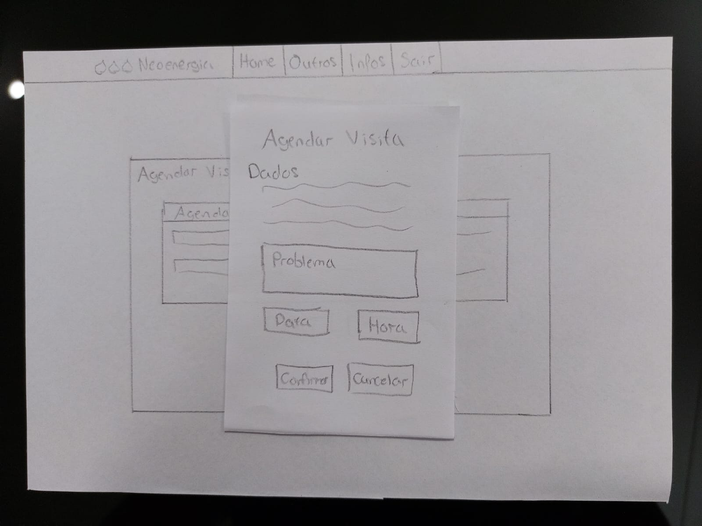
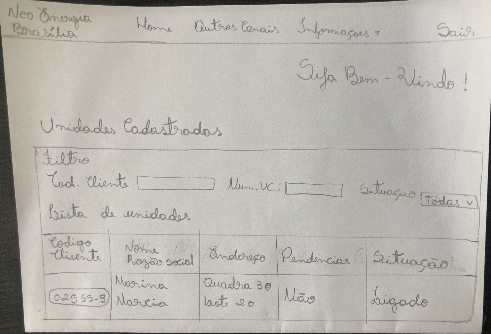
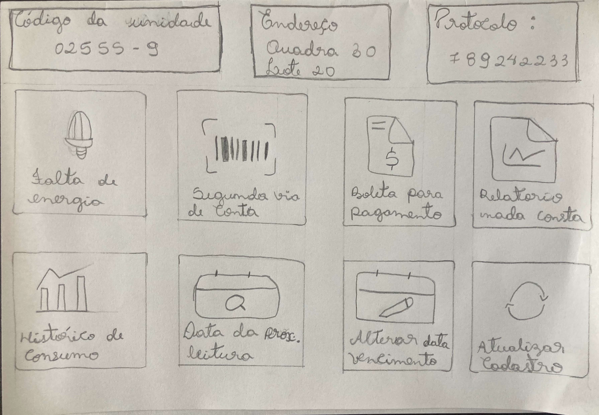
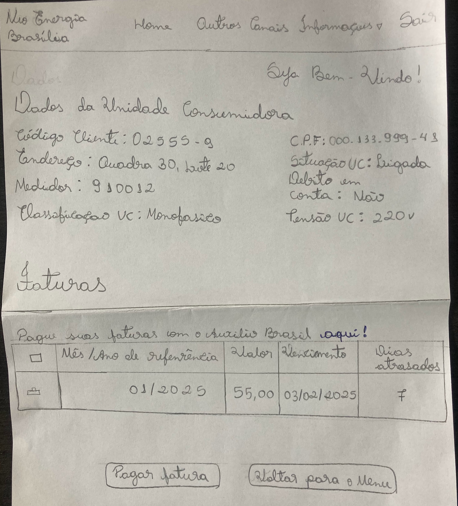

# **Protótipo de Papel**

## **Introdução**

O protótipo de papel é uma técnica amplamente utilizada nas fases iniciais do design de interfaces. Ele consiste na criação de representações simples e de baixo custo de uma interface por meio de esboços feitos à mão ou com ferramentas básicas, permitindo a visualização e validação rápida de ideias. Esse tipo de prototipagem possibilita explorar alternativas de design, identificar problemas de usabilidade e engajar usuários e stakeholders no processo de desenvolvimento. Por ser uma abordagem iterativa, o protótipo de papel promove a colaboração e a flexibilidade, ajustando-se facilmente às mudanças e evitando custos elevados associados a alterações em estágios mais avançados do projeto.

## **Objetivo**

O objetivo deste documento é apresentar os protótipos de baixa-fidelidade, realizados com a técnica de protótipo de papel, feitos pela equipe durante a segunda etapa do projeto. Os protótipos são referentes às tarefas já apresentadas no artefato da Análise de Tarefas, representando essas funcionalidades do site da Neoenergia.

## **Protótipos**

### **Agendar Visita Técnica**

Este protótipo é referente à funcionalidade de agendar visita técnica. O usuário acessa o site, faz o login, escolhe a unidade, acessa a função e realiza o agendamento.

**Figura 1:** Tela inicial

{ width="800px"} 

_Fonte: Henrique Alencar_

**Figura 2:** Tela de login

{ width="800px"}

_Fonte: Henrique Alencar_

**Figura 3:** Tela de unidades

{ width="800px"}

_Fonte: Henrique Alencar_

**Figura 4:** Tela do menu

{ width="800px"}

_Fonte: Henrique Alencar_

**Figura 5:** Tela de agendamentos

{ width="800px"}

_Fonte: Henrique Alencar_

**Figura 6:** Tela de novo agendamento

{ width="800px"}

_Fonte: Henrique Alencar_

### **Emissão de segunda via de conta**

Este protótipo é referente à funcionalidade de emitir segunda via de conta. 

#### Primeiro passo:
Após fazer login o usuario será  redirecionado para a tela da figura 1, onde é possivel ver dados pessoais e a unidade consumidora. Clique no botão de codigo do cliente para seguir para a proxima tela.

**Figura 1:** Tela de dados pessoais e unidades consumidoras

{ width="800px"}

_Fonte: Dara Maria_

#### Segundo passo:
A figura 2 é a tela de menus. Clique no icone de segunda via de conta para seguir para a proxima tela.

**Figura 2:** Tela de Menu

{ width="800px"}

_Fonte: Dara Maria_

#### Ultimo passo:
A figura 3 é a tela onde o usuario consegue visualizar as contas disponiveis em seu nome. Clique no icone de impressora, primeira coluna, após isso o site irá fazer um download da conta escolhida diretamente no seu dispositivo.

**Figura 2:** Tela de contas disponiveis

{ width="800px"}

_Fonte: Dara Maria_

## **Histórico de versão**

| Versão | Data       | Descrição                                  | Autor(es)                                       | Revisor                 |
| ------ | ---------- | ------------------------------------------ | ----------------------------------------------- | ----------------------- |
| `1.0`  | 26/12/2025 | Adição do protótipo de agendamento         | [Henrique Alencar](https://github.com/henryqma) | Dara Maria, Davi Casseb |
| `1.1`  | 09/02/2025 | Adição do passo a passo do prototipo         | [Dara maria](https://github.com/daramariabs) | Davi Casseb, Henrique Alencar |