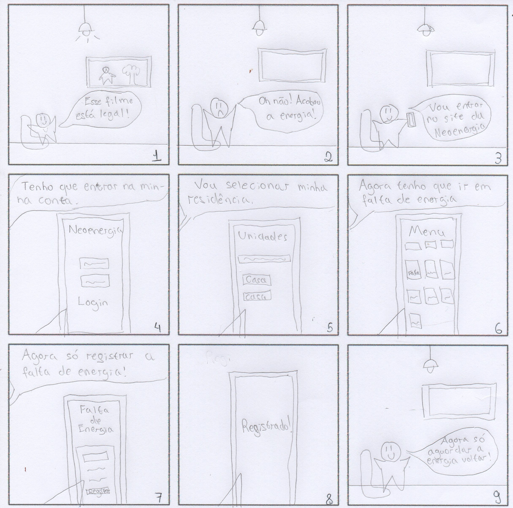

# Storyboards

## Introdução

Os storyboards são utilizados como uma ferramenta no design de interação para explorar ideias sobre como melhorar a prática de trabalho dos usuários com o suporte oferecido pela tecnologia. Eles auxiliam o designer a projetar soluções que aprimorem o trabalho dos usuários, permitindo visualizar e planejar a interface e a interação de forma mais clara. Uma vez criados, os storyboards ajudam a consolidar ideias e servem como base para o desenvolvimento de protótipos, possibilitando um processo iterativo de refinamento até alcançar uma solução satisfatória​. Neste documento, iremos realizar um storyboard para cada tarefa analisada, mostrando a imagem do storyboard e especificando as pessoas envolvidas, o ambiente, as tarefas, os passos envolvidos, a motivação e o resultado.

## Tarefa 1 - Registrar Falta de Energia

O storyboard apresentado na figura 1 representa um usuário utilizando o sistema quando teve um problema de falta de energia.

Figura 1: Storyboard de falta de energia

{ width="600px"}

_Fonte: Henrique Alencar_

### Pessoas envolvidas: 

 - Carlos, 42 anos, gerente financeiro. Apenas um usuário comum.

### Ambiente: 

- Em sua casa, na sala assistindo TV.

### Tarefas:

 - Acessar o site da neoenergia, logar, escolher sua residência, registrar falta de energia.

### Passos envolvidos:

  1. Acessar o site; 
  2. Inserir os dados para fazer login; 
  3. Escolher sua residência; 
  4. Acessar a função de falta de energia no menu. 
  5. Registrar o problema de energia.

### Motivação de usar a aplicação: 

- Resolver seu problema de energia.

### O que precisam fazer: 

- Acessar o site e registrar o problema.

### O que motivou a usar o sistema: 

- Facilidade de acessar o site e rapidez ao realizar a tarefa.

### Resultado ao completar a tarefa: 

- Carlos se sentiu satisfeito em ter feito o registro e agora aguarda a resolução do seu problema.

## Tarefa 2 - Retirar segunda via 

- O storyboard apresentado na figura 2 representa um usuário retirando uma segunda via no site.

Figura 2: Storyboard de retirar segunda via

{ width="600px"}

_Fonte: Dara Maria_

### Pessoas envolvidas
- João, cliente residencial, 34 anos
 
### Ambiente
- Casa, usando um computador pessoal conectado à internet.
- Navegador web com a página inicial e outras áreas do site da Neoenergia abertas.
 
### Motivação para usar a aplicação
- Resolver o problema de pagar a fatura de energia ao não encontrar o documento físico.
 
### Tarefas e passos envolvidos

1. Acesso ao site 

    - João digita o endereço do site da Agência Virtual no navegador.  
    - Ele acessa a página inicial e sente-se confiante ao localizar o site correto.
 
2. Login no sistema  

    - João tenta inserir o CPF e a senha e faz login com sucesso, sentindo-se satisfeito.
 
3. Localização da fatura 

    - Após o login, João acessa o menu principal.  
    - Localiza e seleciona a opção "Segunda Via de Conta".  
    - Visualiza a lista de faturas em aberto e encontra a fatura desejada.
 
4. Emissão da segunda via 

    - João seleciona a fatura correspondente.  
    - Visualiza o PDF da conta diretamente no site.  
    - Clica no botão "Baixar" para salvar o arquivo em seu computador.  
    - Fica aliviado e satisfeito ao concluir essa etapa.
 
### Resultado
- João está contente e aliviado por ter conseguido resolver seu problema de forma eficiente e sem grandes dificuldades. Ele finaliza a interação com o sistema satisfeito com a usabilidade e rapidez da plataforma.

## Bibliografia
> BARBOSA, S.D.J.; SILVA, B.S. Interação Humano-Computador. Editora Campus-Elsevier, 2010.

## Histórico de versão

| Versão | Data       | Descrição                                  | Autor(es)                                       | Revisor                 |
| ------ | ---------- | ------------------------------------------ | ----------------------------------------------- | ----------------------- |
| `1.0`  | 10/12/2024 | Criação da página                          | [Henrique Alencar](https://github.com/henryqma) | Dara Maria, Davi Casseb |
| `1.1`  | 10/12/2024 | Adição de storyboard 2                     | [Henrique Alencar](https://github.com/henryqma) | Dara Maria, Davi Casseb |