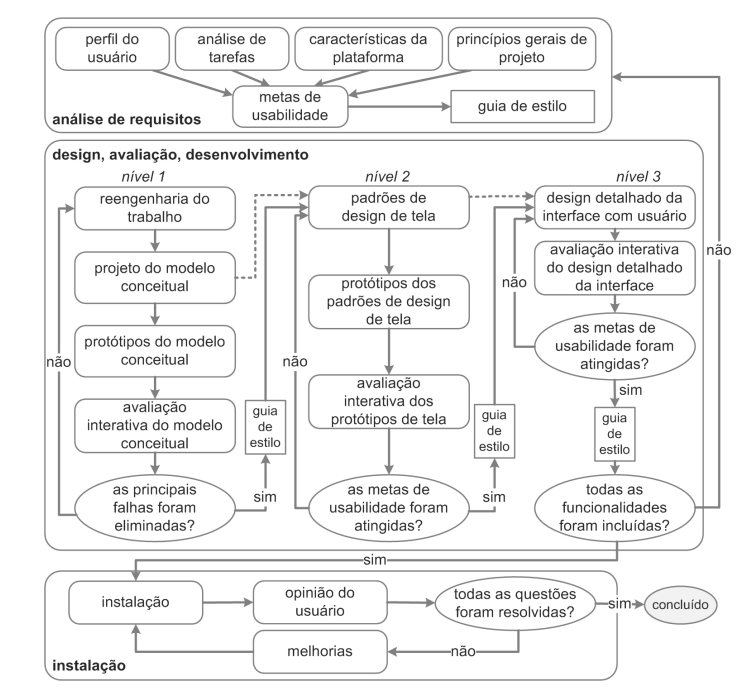

#Processo de Design

## Introdução
O processo de design pode ser compreendido como um conjunto de três etapas fundamentais: primeiramente, realiza-se um exame detalhado do contexto atual; em seguida, desenvolve-se uma proposta de intervenção; e por fim, examina-se os resultados obtidos com as mudanças implementadas. Essa visão é compartilhada por especialistas da área como Lawson (2006) e Lowgren e Stolterman (2007). A partir dessa estrutura básica, diferentes metodologias podem ser desenvolvidas, dando origem aos diversos processos de design.

Na literatura especializada sobre Interação Humano-Computador, especificamente no capítulo 4, encontramos várias abordagens metodológicas. Entre elas, destacam-se seis principais processos: o Ciclo de Vida em Estrela, a metodologia de Engenharia de Usabilidade proposta por Nielsen, o modelo de Engenharia de Usabilidade desenvolvido por Mayhew, além das abordagens de Design Contextual, Design Baseado em Cenários e Design Dirigido por Objetivos.

Cada uma dessas metodologias estabelece uma sequência específica de fases e determina quais documentos e elementos (artefatos) devem ser produzidos ao término de cada etapa.

Para o projeto em questão, a equipe considerou alguns desses processos, sendo eles:

## Objetivo
Este artefato tem por objetivo documentar o processo de design escolhido pelo grupo.

## metodologia

## Processo de Design Simples

O processo de design simples é uma abordagem para criar soluções de design de forma eficiente e direta, concentrando-se nos princípios fundamentais do design e na resolução de problemas de maneira clara e concisa. Por ser um processo simples, qualque pessoas mesmo sem muita experiência pode utilizá-lo. Entretanto, também por ser simples e não muito detalhado, indivíduos não muito experientes poderão encontrar dificuldades nos artefatos a serem produzidos. Na figura 1 temos o diagrama do Ciclo de Vida Simples.

 Figura 1: Ciclo de Vida Simples 
 

# Ciclo de Vida em Estrela

O modelo de Ciclo de Vida Estrela foi proposto em 1989 por Hartson e Hix e é composto por seis atividades: análise de tarefas, especificação de requisitos, projeto conceitual e formal, prototipação, implementação e avaliação. Este modelo privilegia a liberdade no começo do processo de design, pois permite que o processo de design tenha início em qualquer uma dessas etapas, o que pode ser ruim para indivíduos pouco experientes, por não serem muito detehadas as tarefas. "A atividade de avaliação aparece no modelo como central, e é de fato desdobrada na avaliação dos resultados de cada uma das demais atividades"(Barbosa e Silva, 2010). Na figura 2 temos um diagrama de como funciona o Ciclo de Vida em Estrela.

 Figura 2: Ciclo de Vida em Estrela
 

# Engenharia de Usabilidade de Nielsen

Nielsen (1993) propõe um conjunto de 10 atividades que deverão ocorrer durante todo o ciclo de vida do produto como um processo de design. Ele também defende que muitas das etapas ocorrerão no início de cada projeto, antes que a interface em si seja concretizada. São estas etapas:
1. Conheça seu usuário
2. Realize uma análise competitiva
3. Defina as metas de usabilidade
4. Faça designs paralelos
5. Adote o design participativo
6. Faça o design coordenado da interface como um todo
7. Aplique diretrizes e análise heurística
8. Faça protótipos
9. Realize testes empíricos
10. Pratique design iterativo

# Engenharia de Usabilidade de Mayhew

Este modelo, proposto por Deborah Mayhwew, orienta indíviduos com um conjunto de tarefas num fluxo de controle com três fases principais: análise de
requisitos, design/avaliação/desenvolvimento e instalação. Nesse processo as atividades são bem detalhadas e possuem perguntas (passos de validação) no fluxo de controle geral, importantes para validação de cada um dos artefatos. O que é bom para indivíduos menos experientes. Na figura 3 temos um exemplo da engenharia de usabilidade de Mayhew.

 Figura 3: Ciclo de Engenharia de Usabilidade de Mayhew
 

# Processo de design definido para o projeto

Pelo detalhamento do processo de design de Mayhew, a equipe optou por utilizá-lo. Já que é um processo detalhado suficientemente bem para guiar indivíduos sem muita experiência.

## Bibliografia
> PREECE, J.; ROGERS, Y; SHARP, H. Design de Interação: Além da Interação Humano-Computador. Editora Bookman, 2013.

> BARBOSA, S.D.J.; SILVA, B.S. Interação Humano-Computador. Editora Campus-Elsevier, 2010.

> Lawson B. How Designers Think: The Design Process Demystified 4a edição. Oxford, UK: Architectural Press; 2006.

> Löwgren J, Stolterman E. Thoughtful Interaction Design: A Design Perspective on Information Technology. Cambridge, MA: The MIT Press; 2004;.

## Histórico de Versão

| Versão | Data       | Descrição                                | Autor(es)                                                                                       | Revisor(es)                                                                                                                                    |
| ------ | ---------- | ---------------------------------------- | ----------------------------------------------------------------------------------------------- | ---------------------------------------------------------------------------------------------------------------------------------------------- |
| `1.0`  | 09/11/2024 | Criação da página                     | [Henrique Alencar](https://github.com/henryqma) | Todos |
| `1.1`  | 12/11/2024 | Adição do Processo de Design                     | [Davi Casseb](https://github.com/dcasseb) | Todos |
