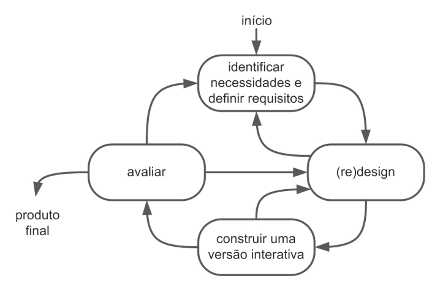
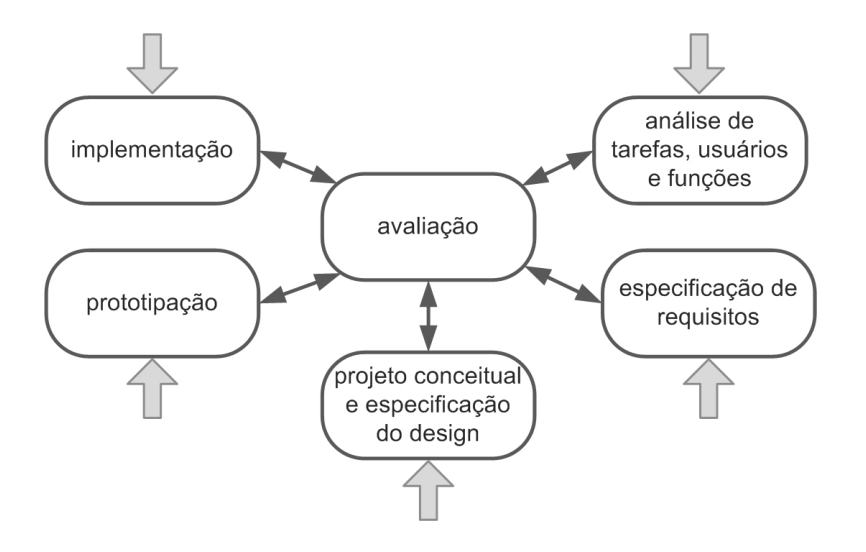

# Processo de Design

## Introdução

O processo de design pode ser compreendido como um conjunto de três etapas fundamentais: primeiramente, realiza-se um exame detalhado do contexto atual; em seguida, desenvolve-se uma proposta de intervenção; e por fim, examina-se os resultados obtidos com as mudanças implementadas. Essa visão é compartilhada por especialistas da área como Lawson (2006) e Lowgren e Stolterman (2007). A partir dessa estrutura básica, diferentes metodologias podem ser desenvolvidas, dando origem aos diversos processos de design.

Na literatura especializada sobre Interação Humano-Computador, especificamente no capítulo 4, encontramos várias abordagens metodológicas. Entre elas, destacam-se seis principais processos: o Ciclo de Vida em Estrela, a metodologia de Engenharia de Usabilidade proposta por Nielsen, o modelo de Engenharia de Usabilidade desenvolvido por Mayhew, além das abordagens de Design Contextual, Design Baseado em Cenários e Design Dirigido por Objetivos.

Cada uma dessas metodologias estabelece uma sequência específica de fases e determina quais documentos e elementos (artefatos) devem ser produzidos ao término de cada etapa.

Para o projeto em questão, a equipe considerou alguns desses processos, sendo eles:

## Objetivo

O presente documento visa apresentar e detalhar a metodologia de design selecionada pela equipe após análise criteriosa das diferentes abordagens disponíveis. Esta documentação servirá como referência para compreensão e implementação do processo escolhido.

## Metodologia

Para definir a abordagem mais adequada, a equipe empregou uma estratégia baseada em pesquisa e análise comparativa. O processo envolveu um levantamento sistemático das diferentes metodologias de design disponíveis, seguido de uma avaliação criteriosa das opções identificadas. Após essa análise abrangente, o grupo selecionou a metodologia que melhor atendia às necessidades específicas do projeto.

## Ciclo de Vida Simples

A metodologia do design simples representa uma forma objetiva e prática de desenvolver soluções de design, com foco na aplicação dos elementos essenciais do design e na busca por resoluções práticas e diretas dos problemas identificados. Esta abordagem tem a vantagem de ser acessível mesmo para iniciantes na área, devido à sua natureza descomplicada.
No entanto, é importante notar que esta simplicidade também pode apresentar desafios. A ausência de detalhamentos mais específicos pode criar obstáculos para profissionais menos experientes, especialmente no que diz respeito à elaboração dos documentos e elementos necessários ao longo do processo.

O diagrama apresentado na figura 1 ilustra a estrutura do Ciclo de Vida Simples, demonstrando visualmente como as etapas se conectam e se desenvolvem.

 Figura 1: Ciclo de Vida Simples 
 

## Ciclo de Vida Estrela

Em 1989, Hartson e Hix introduziram uma metodologia inovadora conhecida como Ciclo de Vida Estrela. Este modelo se estrutura em torno de seis componentes principais: a análise das tarefas, o levantamento dos requisitos, as etapas de projeto conceitual e formal, o desenvolvimento de protótipos, a fase de implementação e o processo de avaliação.
Uma característica distintiva desta abordagem é sua flexibilidade inicial, permitindo que os profissionais iniciem o processo a partir de qualquer uma das etapas mencionadas. Embora esta flexibilidade possa ser vantajosa em certos contextos, ela pode representar um desafio para profissionais iniciantes, principalmente devido à ausência de um roteiro mais detalhado das atividades a serem executadas.
O elemento avaliativo ocupa uma posição central neste modelo, funcionando como um núcleo que interage com todas as outras etapas do processo. Como observado na literatura: "A atividade de avaliação aparece no modelo como central, e é de fato desdobrada na avaliação dos resultados de cada uma das demais atividades" (Barbosa e Silva, 2010).

A estrutura e o funcionamento do Ciclo de Vida em Estrela podem ser visualizados no diagrama apresentado na figura 2.

 Figura 2: Ciclo de Vida em Estrela
 

## Engenharia de Usabilidade de Nielsen

A metodologia proposta por Nielsen (1993) estabelece um conjunto abrangente de dez atividades essenciais que devem ser executadas ao longo de todo o ciclo de desenvolvimento do produto. O autor enfatiza que uma parte significativa dessas etapas precisa ser realizada nas fases iniciais do projeto, antes mesmo da materialização da interface.

As atividades fundamentais deste processo são:
1. Conheça seu usuário
2. Realize uma análise competitiva
3. Defina as metas de usabilidade
4. Faça designs paralelos
5. Adote o design participativo
6. Faça o design coordenado da interface como um todo
7. Aplique diretrizes e análise heurística
8. Faça protótipos
9. Realize testes empíricos
10. Pratique design iterativo

## Engenharia de Usabilidade de Mayhew

A metodologia elaborada por Deborah Mayhew apresenta uma estrutura organizacional que se divide em três etapas fundamentais: inicialmente, há a fase de análise de requisitos; em seguida, desenvolve-se o processo integrado de design, avaliação e desenvolvimento; e por fim, realiza-se a etapa de instalação.
Um diferencial significativo deste modelo é sua natureza meticulosa na descrição das atividades, incorporando pontos de verificação estratégicos ao longo do fluxo de trabalho. Estes pontos de controle funcionam como guias de validação, permitindo uma avaliação sistemática de cada componente desenvolvido durante o processo.
Esta abordagem sistematizada e detalhada torna-se particularmente benéfica para profissionais em início de carreira ou aqueles com menor experiência na área, proporcionando um roteiro claro e estruturado a ser seguido.
A estrutura completa da engenharia de usabilidade proposta por Mayhew pode ser visualizada na figura 3, que ilustra a interconexão entre as diferentes fases e seus respectivos elementos de validação.

 Figura 3: Ciclo de Engenharia de Usabilidade de Mayhew
 

## Processo de design definido para o projeto

Após cuidadosa análise das diferentes metodologias disponíveis, a equipe decidiu implementar o modelo desenvolvido por <b>Mayhew</b>. Esta escolha fundamentou-se principalmente no caráter minucioso e estruturado desta abordagem, que oferece diretrizes claras e abrangentes, características particularmente valiosas para equipes que não possuem experiência na área de design.

### Bibliografia
> PREECE, J.; ROGERS, Y; SHARP, H. Design de Interação: Além da Interação Humano-Computador. Editora Bookman, 2013.

> BARBOSA, S.D.J.; SILVA, B.S. Interação Humano-Computador. Editora Campus-Elsevier, 2010.

### Referências Bibliográficas
> Lawson B. How Designers Think: The Design Process Demystified 4a edição. Oxford, UK: Architectural Press; 2006.

> Löwgren J, Stolterman E. Thoughtful Interaction Design: A Design Perspective on Information Technology. Cambridge, MA: The MIT Press; 2004;.

## Histórico de Versão

| Versão | Data       | Descrição                                | Autor(es)                                                                                       | Revisor(es)                                                                                                                                    |
| ------ | ---------- | ---------------------------------------- | ----------------------------------------------------------------------------------------------- | ---------------------------------------------------------------------------------------------------------------------------------------------- |
| `1.0`  | 09/11/2024 | Criação da página                     | [Henrique Alencar](https://github.com/henryqma) | Dara Maria, Davi Casseb |
| `1.1`  | 12/11/2024 | Adição do Processo de Design                     | [Davi Casseb](https://github.com/dcasseb) | Dara Maria, Henrique Alencar |
| `1.2`  | 25/11/2024 | Correção dos revisores e adição das referências bibliográficas                     | [Davi Casseb](https://github.com/dcasseb) | Dara Maria, Henrique Alencar |
