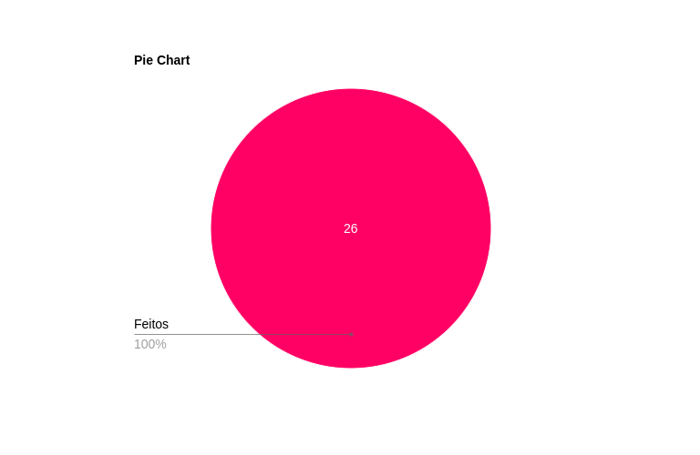

# Verificação Etapa 03

## Introdução
A verificação de artefatos é uma etapa importante no projeto, pois garante que os produtos de trabalho atendam aos requisitos especificados. Esta técnica analisa detalhadamente o conteúdo e a estrutura dos artefatos para avaliar sua qualidade e conformidade.

## Objetivo
O objetivo principal deste documento de planejamento de verificação é assegurar que os artefatos produzidos durante a etapa 3 pelo nosso grupo estejam em conformidade com os requisitos especificados e atendam aos critérios de qualidade estabelecidos para o projeto. 

## Metodologia 
A metodologia escolhida será a lista de verificação, é apresentada como uma técnica organizada e eficiente para avaliar artefatos de design. E esse método possui o uso de listas predefinidas de critérios que ajudam os avaliadores a identificar se um artefato atende aos padrões e diretrizes estabelecidos. 

## Verificação do nosso grupo

### Desenvolvimento do projeto 

| **Questão** | **Descrição** | **Resposta (Sim / Não / Incompleto)** | **Versão, Data e Hora da Avaliação** |
|:-----------:|---------------|:-------------------------------------:|:------------------------------------:|
| 1           | O histórico de versão está padronizado?              |                   Sim                    |          1.2   03/12 - 23h30                            |
| 2           | Autor(es) e revisor(es) estão identificados para cada artefato? |            Sim                    |              1.2   03/12 - 23h30                        |
| 3           | Referências bibliográficas estão presentes em todos os artefatos? |           Sim               |                1.2   03/12 - 23h30                      |
| 4           | Tabelas e imagens possuem legenda e fonte, sendo chamadas no texto? |         Sim         |                   1.2   03/12 - 23h30                   |
| 5           | Há um texto de introdução aos artefatos?              |                 Sim                      |            1.2   03/12 - 23h30                          |
| 6           | O cronograma executado detalha responsáveis e datas de início e fim? |       Sim            |                1.3   03/12 - 23h30                      |
| 7           | Existem atas das reuniões com informações completas?  |                Sim                       |            1.2   03/12 - 23h30                          |
| 8           | As reuniões foram gravadas?                          |                 Sim                      |            1.2   03/12 - 23h30                          |
| 9           | Existe um vídeo de apresentação na categoria "não listado" no YouTube? |    Sim       |               1.0   03/12 - 23h30                       |

### Conteúdo da Disciplina  

| **Questão** | **Descrição** | **Resposta (Sim / Não / Incompleto)** | **Versão, Data e Hora da Avaliação** |
|:-----------:|---------------|:-------------------------------------:|:------------------------------------:|
| 10          | As características da plataforma foram consideradas no projeto? |   Sim      |                   1.1   03/12 - 23h30                    |
| 11          | Os Princípios Gerais do Projeto foram definidos?     |             Sim                          |                 1.0   03/12 - 23h30                      |
| 12          | Os Princípios Gerais do Projeto incluem todos os tópicos (expectativas, simplicidade, controle, etc.)? | Sim |              1.0   03/12 - 23h30                         |
| 13          | As metas de usabilidade ou objetivos de avaliação de IHC foram estabelecidos? | Sim |                  1.0   03/12 - 23h30                     |
| 14          | A razão para a escolha das metas de usabilidade foi apresentada? |   Sim   |             1.0   03/12 - 23h30                          |
| 15          | Um Guia de Estilo foi desenvolvido para o projeto?   |               Sim                        |           1.1   03/12 - 23h30                            |
| 16          | O Guia de Estilo segue uma estrutura completa (introdução, elementos de interface, interação, etc.)? | Sim |         1.1   03/12 - 23h30                              |
| 17          | O Guia de Estilo corresponde ao site avaliado?       |    Sim  | 1.1   03/12 - 23h30  |

## Gráfico de Tarefas

**Figura 1:** Gráfico de Tarefas

{ width="800px"}

_Fonte: Davi Casseb_

## Bibliografia
> BARBOSA, S.D.J.; SILVA, B.S. Interação Humano-Computador. Editora Campus-Elsevier, 2010.

> SALES. Plano de Ensino. Outubro de 2004. Disponível em: <a href="hhttps://aprender3.unb.br/pluginfile.php/2972625/mod_resource/content/56/Plano_de_Ensino%20FIHC%20022024%20Turma%2001%20v1.pdf" target="_blank">Aprender3</a>.

## Histórico de versão

| Versão | Data       | Descrição                                | Autor(es)                                                                                       | Revisor(es)                                                                                                                                    |
| ------ | ---------- | ---------------------------------------- | ----------------------------------------------------------------------------------------------- | ---------------------------------------------------------------------------------------------------------------------------------------------- |
| `1.0`  | 03/12/2024 | Criação da página                     | [Henrique Alencar](https://github.com/henryqma) | Dara Maria, Davi Casseb |